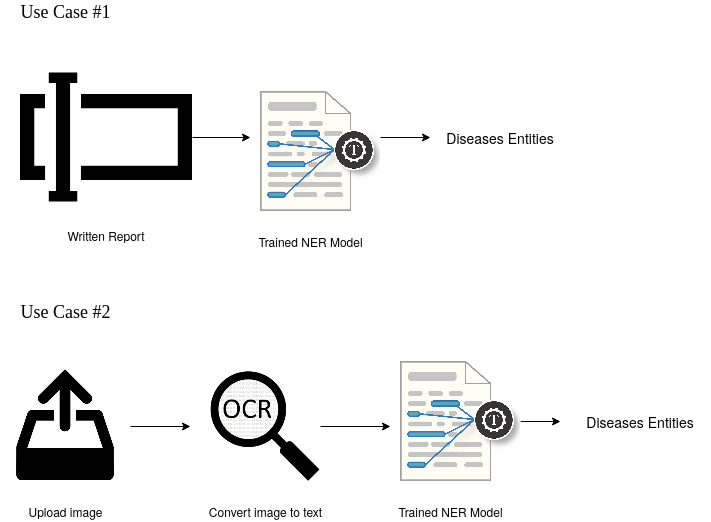

# MedContext: Named Entity Recognition in Medical Text


## An Overview
This Flask application is designed to assist anyone who wants to extract diseases' entities from written and/or pictured reports. This could be considered as a simple medical report analyser.


## Demo

- Get Diseases' Entities within Text


- Get Diseases' Entities within Image


## Requirements

spacy==2.3.2  
en-core-web-md==2.3.1  
en-core-web-sm==2.3.1  
Flask==1.1.2  
numpy==1.19.2  
opencv-python==4.4.0.44  
Pillow==7.2.0  
pyparsing==2.4.7  
pytesseract==0.3.6  

## Setup
- Create an environment
```
virtualenv medcontextEnv

source medcontextEnv/bin/activate
```
- Install requirements
```
pip install requirements.txt
```
- Run the app
```
python app.py
```

## Use Cases 

