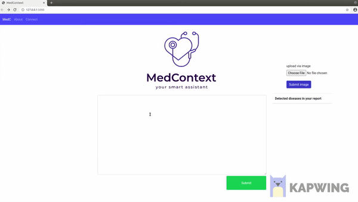
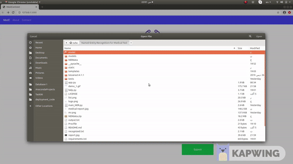

# MedContext: Named Entity Recognition for Medical Text

## An Overview
This Flask application is designed to assist anyone who wants to extract diseases' entities from written and/or pictured reports. This could be cosidered as a simple medical report analyser. 

## Requirements

spacy==2.3.2

numpy==1.19.2

opencv-python==4.4.0.44

Pillow==7.2.0

pyparsing==2.4.7

pytesseract==0.3.6

## Features

### Get Diseases' Entities within Text

### Get Diseases' Entities within Image

